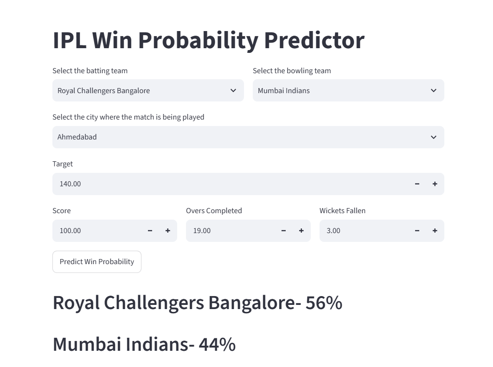

<h1 align="center">🏏 IPL Win Probability Predictor</h1>

<p align="center">
A Machine Learning-powered Streamlit application that predicts the winning probability of IPL teams in the second innings using historical IPL match data.
</p>

<p align="center">
  
  
  
  
</p>

---

## 📖 Overview

The **IPL Win Probability Predictor** is an end-to-end Machine Learning project that predicts the probability of either team winning an IPL match during the second innings.

The application combines historical IPL match data with live match information to generate real-time winning probabilities through an interactive **Streamlit** web interface.

---

## ✨ Features

- 🏏 Predicts live IPL win probability
- 📊 Trained using historical IPL datasets
- ⚡ Real-time predictions
- 🌆 Venue-aware prediction
- 👥 Supports all IPL teams
- 🎯 Clean and interactive Streamlit UI
- 🤖 Machine Learning powered

---

## 🛠 Tech Stack

| Category | Technologies |
|----------|--------------|
| Programming Language | Python |
| Framework | Streamlit |
| Machine Learning | Scikit-Learn |
| Data Analysis | Pandas, NumPy |
| Model Serialization | Pickle |
| Development | Jupyter Notebook |

---

## 📂 Project Structure

```text
ipl-win-probability-predictor/
│
├── screenshots/
│   └── app.png
│
├── app.py
├── model_training.ipynb
├── model.pkl
├── deliveries.csv
├── matches.csv
├── requirements.txt
├── README.md
└── .gitignore
```

---

## ⚙️ How It Works

1. Load historical IPL datasets.
2. Clean and preprocess the data.
3. Perform feature engineering.
4. Train the Machine Learning model.
5. Save the trained model using Pickle.
6. Load the model into the Streamlit application.
7. Predict winning probabilities from live match inputs.

---

## 📷 Application Preview

<p align="center">
  
</p>

---

## 🚀 Installation

### Clone the repository

```bash
git clone https://github.com/Mohammad-Faiz-2006/ipl-win-probability-predictor.git
```

### Navigate to the project

```bash
cd ipl-win-probability-predictor
```

### Install dependencies

```bash
pip install -r requirements.txt
```

### Launch the application

```bash
streamlit run app.py
```

---

## 📊 Dataset

The project is trained using two IPL datasets:

- **matches.csv** – Match-level information
- **deliveries.csv** – Ball-by-ball delivery data

These datasets are preprocessed and transformed into features used by the Machine Learning model.

---

## 🎯 Future Improvements

- 🔹 Add support for latest IPL seasons
- 🔹 Improve prediction accuracy
- 🔹 Compare multiple Machine Learning models
- 🔹 Deploy on Streamlit Community Cloud
- 🔹 Integrate live match data APIs
- 🔹 Add interactive analytics and visualizations

---

## 👨‍💻 Author

**Mohammad Faiz**

Computer Science Engineering Student

GitHub: **https://github.com/Mohammad-Faiz-2006**

---

<p align="center">
⭐ If you found this project useful, consider giving it a star!
</p>